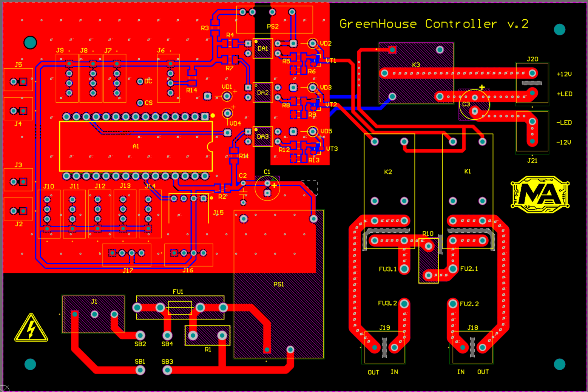
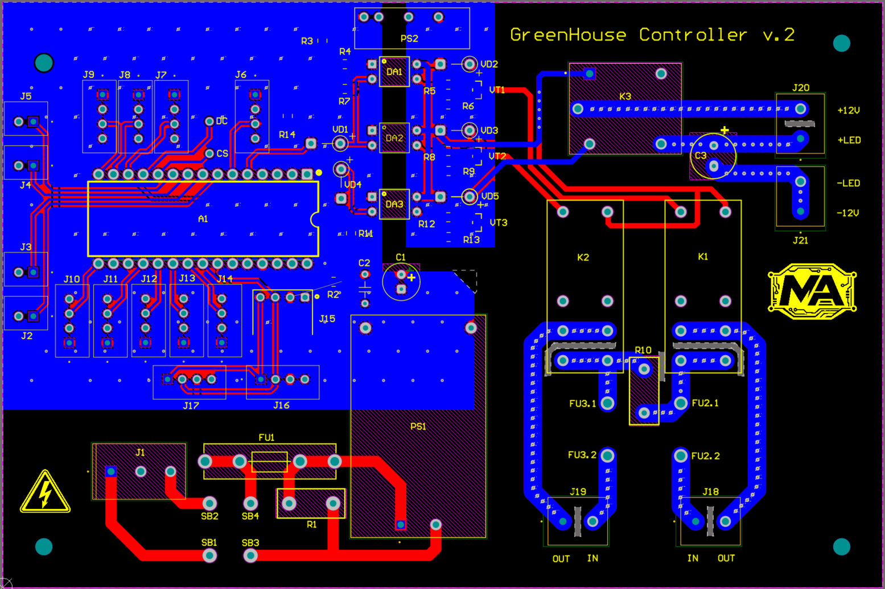
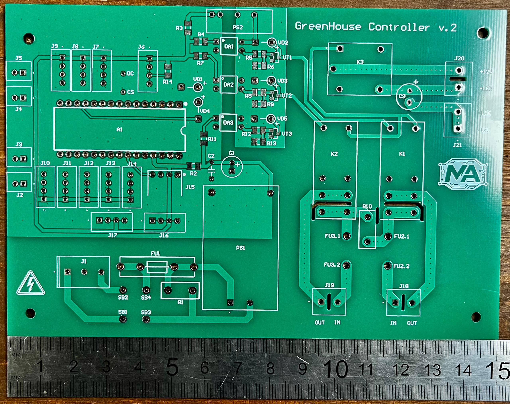
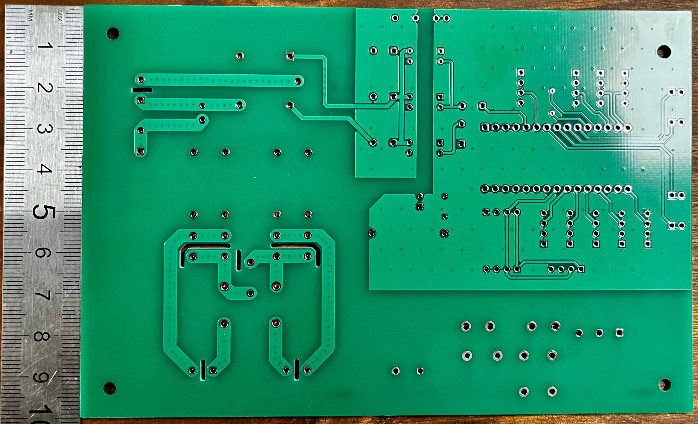
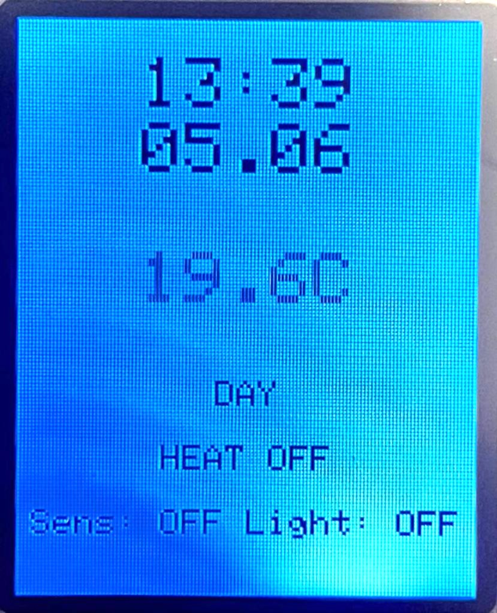
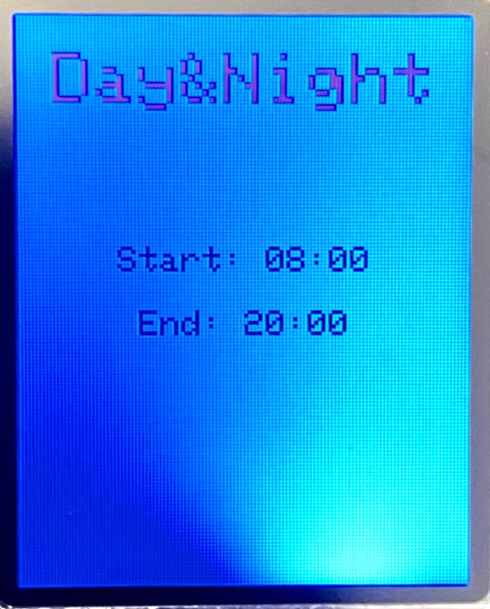
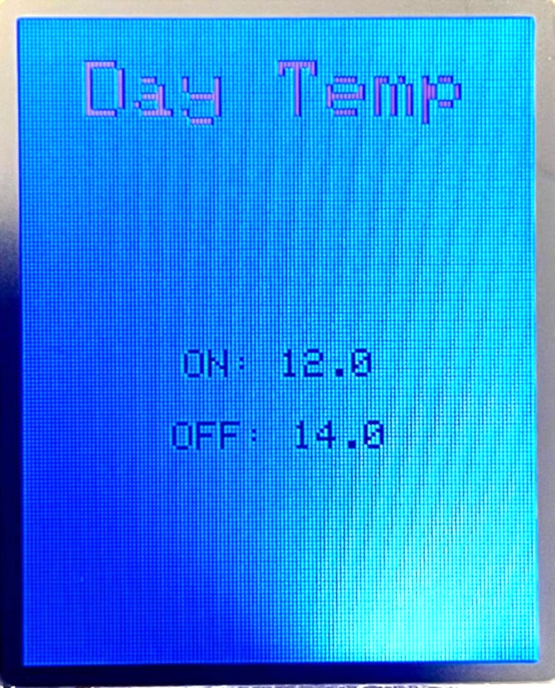
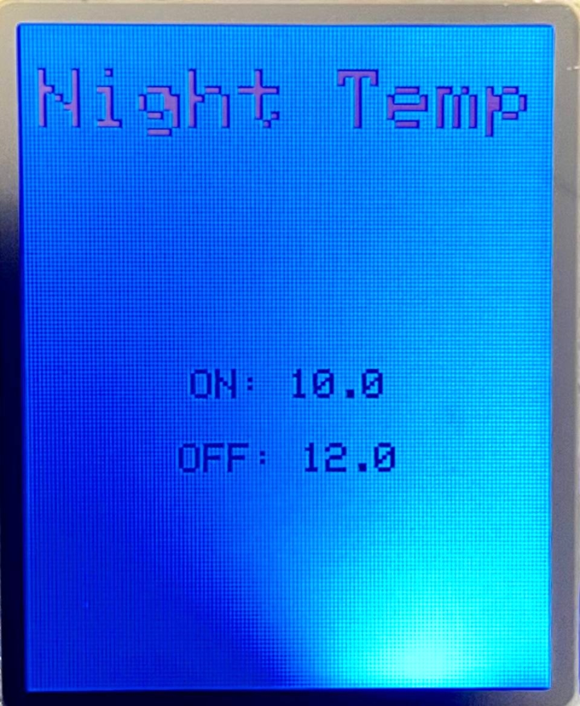
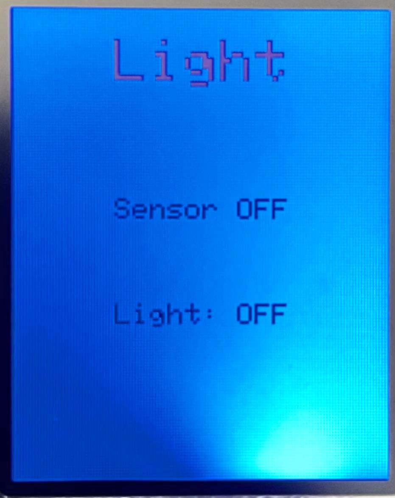
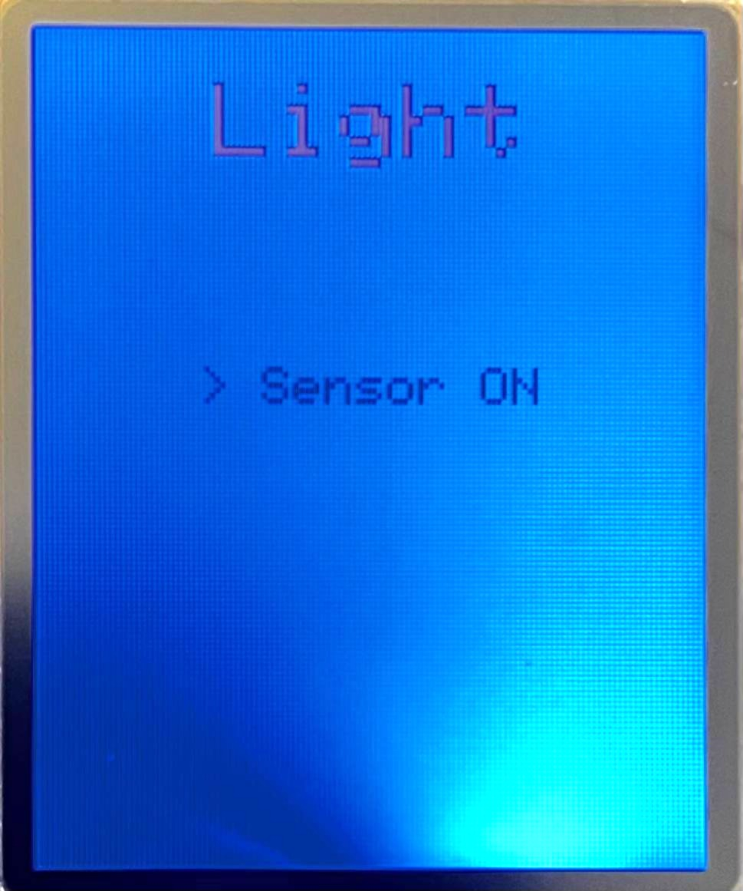

# Smart Greenhouse Controller

Custom greenhouse monitoring and control system based on Arduino Nano and a custom PCB designed in Altium Designer.

The project was initially designed as a flexible greenhouse controller platform with support for multiple sensors and real-time information display on a TFT screen.

The system provides automatic temperature and lighting control with configurable day/night operating modes, TFT user interface and EEPROM-based persistent settings storage.

The project was developed as a practical greenhouse automation solution with potential future commercial application.

The controller is currently deployed in a real greenhouse environment.

# Table of Contents

* [Features](#features)
* [PCB Design](#pcb-design)
* [Power Supply Design](#power-supply-design)
* [Relay Control and Isolation](#relay-control-and-isolation)
* [Firmware](#firmware)
* [Hardware Overview](#hardware-overview)
* [User Interface](#user-interface)
* [Repository Structure](#repository-structure)
* [Current Status](#current-status)
* [Future Improvements](#future-improvements)

## Features

* Day/night operating modes
* Configurable temperature thresholds
* Hysteresis-based heating control
* Automatic and manual light control
* RTC-based scheduling
* TFT graphical user interface
* EEPROM settings storage
* Button-controlled menu navigation
* DS18B20 temperature monitoring
* Relay-controlled heating and lighting outputs

## PCB Design

The PCB was designed and routed in Altium Designer.

Main design goals:

* compact standalone controller design
* galvanic isolation of relay circuits
* onboard AC/DC power conversion
* simple external wiring
* support for future hardware expansion

The current stable hardware revision:

* v2 - stable working revision currently operating in greenhouse conditions

  
  

  Front side (left) and back side (right) of the PCB in Altium Designer.

Future hardware revision:

* v3-development - optimized connector layout, reduced number of unused interfaces and improved PCB routing

## Power Supply Design

The controller includes an onboard AC/DC power supply based on the Hi-Link HLK-5M05 module (220 VAC to 5 VDC, 5 W).
The input power stage includes:

* 5x20 fuse protection
* MOV surge suppression (10K471 varistor)
* output filtering capacitors

## Relay Control and Isolation

Relay control circuits are optically isolated from the microcontroller.

Additional galvanic isolation between the microcontroller and relay power domains is implemented using the B0505S-3WR2 isolated DC/DC converter.

Separate ground domains are used for:

* microcontroller logic
* relay power and switching circuits

All relay driver circuits were designed and routed independently using discrete MOSFET stages instead of prebuilt relay modules.

Heating control is implemented using dual SMIH-05VDC-SL-C relays for simultaneous switching of phase and neutral lines.

Additional heater load protection is implemented using dual line fuses and a MOV surge suppressor connected across the heater output lines.

The maximum heater power is intentionally limited to approximately 2200 W to reduce relay contact stress and improve long-term reliability.

Lighting control uses SRD-05VDC-SL-C relays for switching external 12 V LED power supplies.

## Firmware

The firmware was developed in Arduino IDE and implements:

* menu navigation system
* sensor polling
* RTC scheduling
* EEPROM configuration storage
* hysteresis control logic
* debounced button input handling
* editable user settings interface

The firmware uses persistent EEPROM storage to retain user settings after power loss.

## Hardware Overview

Main hardware components:

* Arduino Nano
* Custom PCB designed in Altium Designer
* 128x160 SPI TFT display based on ST7735 controller
* DS18B20 temperature sensor
* DS3231 RTC module
* Relay-controlled outputs
* LDR-based light sensor module

The PCB was professionally manufactured and implemented as a standalone greenhouse controller.

  
  

  Front side (left) and back side (right) of the manufactured PCB.

## User Interface

The controller uses a simple TFT-based graphical interface navigated using hardware buttons.

The interface allows:

* real-time monitoring of temperature and RTC time
* configuration of day/night operating schedules
* adjustment of heating hysteresis thresholds
* manual and sensor-based lighting control
* status indication for heating and lighting outputs

The lighting control system supports both:

* automatic sensor-based operation
* manual ON/OFF override mode

  

  Main operating screen displaying current temperature, current time and output status

  

  Day/Night scheduling screen with configurable operating time settings.

  
  

  This screen displays configurable ON/OFF temperature thresholds for heater operation in day and night modes

  
  

  This screen displays light sensor status and allows switching between manual and sensor-based lighting control modes

## Repository Structure

* hardware-v2 - stable hardware revision
* hardware-v3-development - next hardware revision containing files related to ongoing development and PCB optimization.

## Current Status

The current hardware revision has been operating continuously in a greenhouse environment for over a month without critical issues.

The project is currently in the testing and optimization stage before further hardware refinement and production-oriented improvements.

## Future Improvements

Planned improvements:

* optimized PCB routing
* reduced number of unused interfaces
* enclosure redesign
* simplified assembly process
* preparation for future small-scale production
* migration to ESP32-based hardware platform with wireless connectivity
* remote greenhouse monitoring and climate control via Wi-Fi
* integration of automated irrigation control
* support for pump and electromechanical valve control
* support for additional environmental sensors such as humidity monitoring
* further PCB optimization based on practical deployment experience